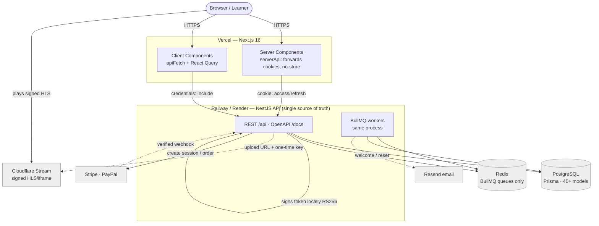
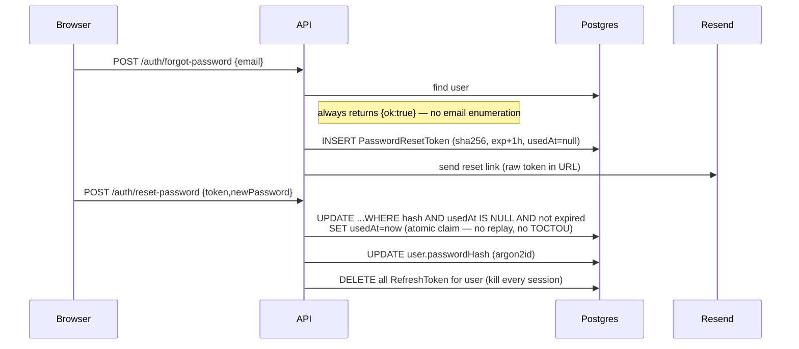
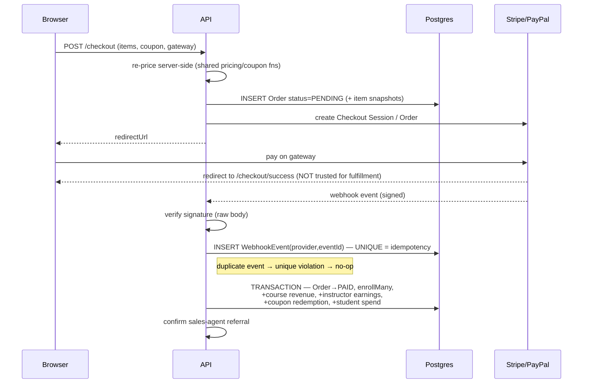
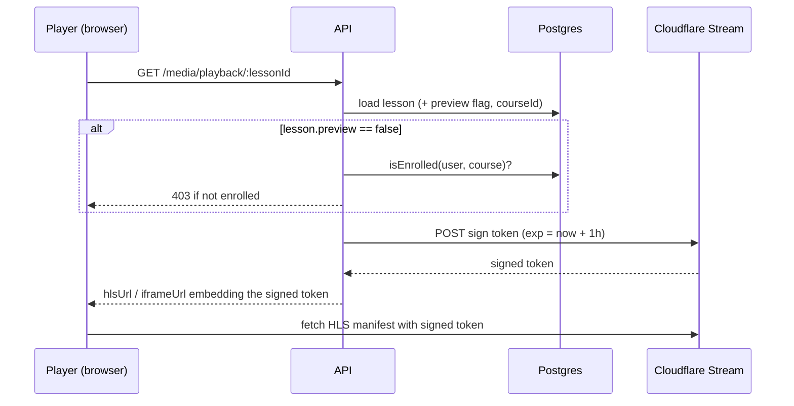
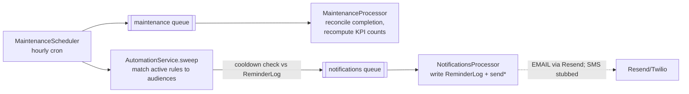

# SkillStream — System Design

> Production architecture for the SkillStream course platform: a NestJS backend
> that owns all data, auth, payments, and media, with the existing Next.js 16
> frontend rewired from its localStorage prototype store onto the real API.

---

## 0. Architecture & flows — read this first

Everything below is diagram-first so a new reader can trace the system end to end
without reading source. Diagrams are [Mermaid](https://mermaid.js.org) and render
inline on GitHub. Section 0.9 is an architectural review: the weaknesses found in
this codebase, what was fixed, and what is recommended next.

### 0.1 System context — who talks to whom



**One rule governs the whole system: the API is the only authority.** The browser
holds no trusted state — every price, entitlement, role, and counter is decided
server-side. The Next.js app is a rendering client that forwards an httpOnly cookie;
it never signs tokens, never computes a price it can act on, never gates a video.

### 0.2 Request lifecycle — what every call passes through

Global providers wire a fixed pipeline in [app.module.ts](../apps/api/src/app.module.ts).
Order matters — auth runs before roles, roles before rate-limit, validation at the
parameter boundary:

```mermaid
flowchart LR
    REQ[HTTP request] --> HELMET[helmet + CORS<br/>cookie-parser]
    HELMET --> JWT{JwtAuthGuard<br/>@Public? skip}
    JWT -->|valid JWT| ROLE{RolesGuard<br/>@Roles match?}
    JWT -->|no/expired| R401[401]
    ROLE -->|ok| THR{ThrottlerGuard<br/>under limit?}
    ROLE -->|wrong role| R403[403]
    THR -->|ok| PIPE[ZodValidationPipe<br/>parse body/params]
    THR -->|over| R429[429]
    PIPE -->|invalid| R400[400 problem+json]
    PIPE -->|valid| CTRL[Controller → Service → Prisma]
    CTRL --> INT[AuditInterceptor<br/>logs mutations]
    INT --> RES[Response]
    R401 & R403 & R429 & R400 & CTRL -.->|throws| FILTER[AllExceptionsFilter<br/>→ RFC7807 problem+json]
```

**Secure by default:** `JwtAuthGuard` is registered globally, so *every* route
requires a valid token unless explicitly annotated `@Public()`. You opt out of
auth, never into it.

### 0.3 Auth: identity model

Two token types, deliberately different (Appendix A6):

| Token | Form | Lifetime | Storage | Revocable? |
|---|---|---|---|---|
| **Access** | Signed JWT (`sub`, `email`, `role`) | 15 min | httpOnly `access_token` cookie | No — stateless, expires fast |
| **Refresh** | Opaque 48-byte random | 7 days | httpOnly `refresh_token` cookie; **only its SHA-256 hash** is stored in `RefreshToken` | Yes — delete the row |

The JWT is never stored server-side; the refresh token is never stored in plaintext.
Passwords are argon2id. `JwtStrategy.validate` re-loads the user from the DB on every
request, so a deleted user or changed role takes effect immediately (Appendix A7).

### 0.4 Login → authenticated request → silent refresh (end-to-end)

This is the flow most people get wrong, so here it is complete — including the
**silent-refresh** step that was missing and is now fixed (see 0.9, finding #1).

```mermaid
sequenceDiagram
    participant B as Browser
    participant W as Next.js client (apiFetch)
    participant A as NestJS API
    participant DB as Postgres

    Note over B,DB: Login
    B->>A: POST /api/auth/login {email,password}
    A->>DB: find user by email
    A->>A: argon2.verify (dummy hash if no user — constant time)
    A->>DB: INSERT RefreshToken (sha256 hash, ua, ip, exp+7d)
    A-->>B: Set-Cookie access_token(15m) + refresh_token(7d), httpOnly
    Note right of A: body returns accessToken + expiresIn only

    Note over B,DB: Normal call, token still valid
    W->>A: GET /api/... (cookie rides along)
    A->>A: JwtStrategy verifies JWT, loads user
    A-->>W: 200

    Note over B,DB: Token expired mid-session (the fixed path)
    W->>A: GET /api/... (access_token expired)
    A-->>W: 401
    W->>A: POST /api/auth/refresh (refresh_token cookie)<br/>single-flight: one refresh even if N calls 401 at once
    A->>DB: look up sha256(refresh); reject if revoked/expired
    A->>DB: DELETE old row, INSERT new (rotation, single-use)
    A-->>W: Set-Cookie new access_token + refresh_token
    W->>A: retry original GET
    A-->>W: 200
```

Why single-flight matters: refresh tokens are **single-use** (rotated on every
refresh). If ten API calls 401 simultaneously and each fired its own refresh, the
first would rotate the token and the other nine would present an already-deleted
token — logging the user out. The client dedupes all concurrent refreshes into one
shared request ([client.ts](../apps/web/lib/api/client.ts)).

### 0.5 Password reset — single-use, DB-backed, session-revoking



Reset tokens are opaque + hashed + single-use, exactly like refresh tokens — a stolen
or replayed link can never reset the password twice, and completing a reset revokes
every existing session.

### 0.6 Checkout → payment → webhook fulfillment (the money path)

Money is only ever granted by a **verified webhook** (or the dev-simulate endpoint) —
never by the browser returning from the gateway.



Idempotency is enforced at the database: the `WebhookEvent(provider, eventId)` unique
constraint means a replayed or duplicated webhook can never double-enroll or
double-credit. Fulfillment is a single Prisma transaction, so partial grants are
impossible (Appendix A9).

> **⚠️ The signature-verification step above is implemented for Stripe only.**
> `handlePaypalWebhook` trusts the request body unverified, so the PayPal branch of this
> diagram describes the intent, not the code. See §0.9 #8 and Appendix C9.

### 0.7 Protected video playback



Videos require signed URLs at the Cloudflare edge; the API mints a 1-hour token only
after confirming enrollment (or that the lesson is a free preview). The raw video UID
never reaches an unentitled client.

### 0.8 Background jobs (BullMQ on Redis)

Producers run in the API process; consumers are `@Processor`s in the same codebase.
Redis backs **queues only** — not caching, not sessions.



The automation engine (`IDLE`, `LOW_PROGRESS`, `ABANDONED_CART`, `ALMOST_DONE`,
`NEW_CONTENT`) is the producer half of marketing: each hour it finds who currently
matches each active rule, respects a per-trigger cooldown, and enqueues reminder jobs.

### 0.9 Architectural review — weaknesses found

Reviewed auth, the request pipeline, the money path, media, and jobs. Findings #1–#4 and
#7 are now **built**, #5–#6 stand as accepted/by-design, and **#8 is an open critical
vulnerability** surfaced by the code-level read in Appendix C — fix it before enabling
PayPal in production. Appendix C16 carries the full list, including the lower-severity
findings.

| # | Finding | Severity | Status |
|---|---|---|---|
| 1 | **Frontend never refreshed the access token.** Backend had full rotating-refresh, a 7-day `refresh_token` cookie was set, but no client code ever called `/auth/refresh`. Sessions silently broke ~15 min after login; users appeared logged out despite a valid 7-day session. | **High** | **Fixed** |
| 2 | **No refresh-token reuse detection.** Rotation hard-deleted the old row, so a stolen-then-rotated token just failed silently — no family kill, no signal. | Medium (security) | **Fixed** |
| 3 | **Refresh rotation wasn't atomic.** `rotateRefreshToken` did `delete` then `create` as two separate awaits; a crash between them forced a re-login. | Low | **Fixed** |
| 4 | **No server-side route authorization on the web.** Portal layouts (`/admin`, `/instructor`, …) are client components with no redirect. An unauthorized user renders an empty shell (the API still 403s every call, so **no data leak**) — but it relied entirely on the API and gave a broken-looking UX. | Low–Medium | **Fixed** |
| 5 | **Per-request DB lookup in `JwtStrategy`.** Every authenticated call loads the user by id. This is a *deliberate* freshness/revocation tradeoff, not a defect — noted so it isn't mistaken for one. Cache behind Redis only if it becomes hot. | Info | By design |
| 6 | **Automation cooldown race** (already `ponytail:`-commented). Cooldown reads `ReminderLog`, which the processor writes on delivery, so an enqueued-but-unprocessed reminder is briefly invisible. Sweep is hourly, jobs drain in seconds — negligible. | Low | Accepted |
| 7 | **Reminder delivery was a stub.** `NotificationsProcessor` wrote `ReminderLog` but never sent. | Info | **Fixed** (email) |
| 8 | **PayPal webhooks are not signature-verified.** `handlePaypalWebhook` reads the event id and order id straight off an unauthenticated request body and fulfils the order. A single crafted POST to the `@Public()` `/api/webhooks/paypal` grants free enrollment on any PENDING order and credits revenue, instructor earnings, and agent commission. Stripe's branch verifies correctly; PayPal's never did. | **Critical** | **Open** |

**#1 — silent refresh.** A single-flight refresh-and-retry in the shared browser fetch
wrapper ([client.ts](../apps/web/lib/api/client.ts)) — the one chokepoint every client
API call routes through. On a browser `401` it calls `/auth/refresh` once (deduped
across concurrent calls) and retries. SSR calls carry `cookieHeader` and are skipped
(a Server Component can't persist a rotated cookie mid-render); those pages render
logged-out and the client `SessionProvider` re-hydrates through the same path.

**#2 + #3 — reuse detection + atomic rotation** ([token.service.ts](../apps/api/src/auth/token.service.ts)).
Rotation now *revokes* the old row (sets `revokedAt`) and mints the new one in a single
`prisma.$transaction` — atomic, no lost sessions. Revoked rows are kept, so a re-presented
rotated token is detected: within a 60s grace window it's treated as a benign tab race,
beyond it every live session for that user is revoked (token-theft response). Expired
rows are swept by the hourly maintenance rollup so they don't accumulate. No migration —
the `revokedAt` column already existed.

**#4 — optimistic route guard** ([proxy.ts](../apps/web/proxy.ts), Next 16 renames
Middleware → Proxy). Logged-out users (no `refresh_token` cookie) are redirected to
`/login?next=…`; on the role portals (`/admin`, `/instructor`, `/sales-agent`) the role
is read from the access-token JWT and mismatches are redirected to the user's own home.
Deliberately optimistic per the Next docs — presence keys off the 7-day refresh cookie
(the access cookie is dropped at 15 min), and the role claim is *decoded, not verified*,
because the API remains the hard authorization boundary.

**#7 — reminder send** ([notifications.processor.ts](../apps/api/src/jobs/notifications.processor.ts)).
`EMAIL` reminders now go out via Resend (`EmailService.sendReminder`); the `ReminderLog`
row is written only after a successful send, so a failure throws and BullMQ retries
without marking it sent or starting the cooldown. SMS has no provider wired and is
logged only.

---

## 1. Where we came from / where we're going

**Prototype (the starting point):** Next.js 16 App Router, ~63 components, four role
surfaces (storefront, student, instructor, admin). **All data was mocked** in
`lib/mock/*` and held in a client-side React Context persisted to `localStorage`
(`lib/context/store.tsx`). No server, no DB, no real auth, no payments, no video,
no cross-device persistence.

**Target:** a production system where a **NestJS backend is the single source of
truth** for data, business logic, auth, payments, and media. The Next.js UI is
**reused as-is** — only its data layer changes (local store → API calls).

The prototype's `types/index.ts` and the 60+ methods in `lib/context/store.tsx`
are the de-facto spec: the backend must cover every store method, and the Prisma
schema mirrors and normalizes every type.

### Locked stack decisions

| Concern | Decision |
|---|---|
| **Auth** | Self-hosted JWT in NestJS — access + rotating refresh, httpOnly cookies, argon2id, RBAC |
| **Video** | Cloudflare Stream (signed playback) |
| **Hosting** | Vercel (web) + Railway/Render (API, Postgres, Redis); Cloudflare for media/CDN |
| **Repo** | Turborepo + pnpm monorepo with a shared package |
| **ORM / DB** | Prisma + PostgreSQL (money stored as integer cents) |
| **Payments** | Stripe + PayPal (one-time course purchases) |
| **Rollout** | Build the complete backend, then rewire the Next.js frontend domain-by-domain |

---

## 1.5 Infrastructure & external services — what you need to provide

Everything except Postgres and the JWT secrets degrades gracefully when unset (dev-only
simulate paths, console-logged emails, a targeted `503` on the specific feature) — the
app still boots and most of it still works locally with just Docker Compose.

| Service | Required? | What it's for | Env vars |
|---|---|---|---|
| **PostgreSQL** | Required | The single datastore — all 28 Prisma models. Local: `docker-compose.yml`. Prod: managed Postgres (Railway/Render/Neon/Supabase). | `DATABASE_URL` |
| **Redis** | Required for jobs | Backs **BullMQ only** — not caching, not sessions. Drives the hourly maintenance rollup (reconciles enrollment completion, recomputes admin KPI counts) and the notifications queue (engagement reminders). `rediss://` scheme enables TLS for managed Redis (e.g. Upstash). Without it, the app still boots but job scheduling logs a warning and no-ops. | `REDIS_URL` |
| **Cloudflare account + Stream product** | Required for video | Direct-creator-upload + signed HLS/iframe playback. Cloudflare Stream stores, encodes, and serves the video itself — **there is no separate object-storage (R2/S3) bucket in this system.** Without these vars, `media.service.ts` throws a `503` on upload/playback only. | `CLOUDFLARE_ACCOUNT_ID`, `CLOUDFLARE_STREAM_TOKEN` |
| **Cloudflare Stream signing key** (optional) | Efficient DRM | Signs playback tokens **locally** (RS256, `node:crypto`) — no per-play API call. One-time `POST /stream/keys`; store id + base64 PEM. Absent → falls back to the per-play API token (still works, just slower). See §5.1. | `CLOUDFLARE_STREAM_KEY_ID`, `CLOUDFLARE_STREAM_KEY_PEM` |
| **Object storage / image CDN (R2, S3, Cloudflare Images, etc.)** | Not integrated | Course thumbnails and avatars are plain URL strings in Postgres (`authoring.service.ts`) — there is no upload endpoint yet. Instructors/admins currently paste an already-hosted image URL from wherever you choose to host images. | — |
| **Stripe account** | Required for card checkout | Checkout Sessions + webhook-verified, idempotent order fulfillment (`WebhookEvent.eventId` unique constraint). | `STRIPE_SECRET_KEY`, `STRIPE_WEBHOOK_SECRET` |
| **PayPal developer app** | Required for PayPal checkout | REST order create/capture + webhook fulfillment, same idempotency path as Stripe. Sandbox vs. live is chosen by `NODE_ENV`. | `PAYPAL_CLIENT_ID`, `PAYPAL_CLIENT_SECRET` |
| **Resend account + verified sending domain** | Required for real email | Welcome, password-reset, org-invite, **and marketing-automation reminder** email (`EMAIL`-channel reminders send via `EmailService.sendReminder`). Unset → emails are logged to console instead of sent (safe for local dev; auth flows still work). SMS-channel reminders have no provider wired and are logged only. | `RESEND_API_KEY`, `RESEND_FROM_EMAIL` |
| **Twilio (or similar SMS provider)** | Not integrated | Reserved for SMS reminders in the automation engine; no code path calls it yet. | — |
| **FX rates feed** | Optional | Daily `Region.fxRate` refresh for the local-currency display hint (see §6). Defaults to a free, keyless USD-base endpoint; override only to swap providers. Unreachable → last known rates are kept and the staleness shows in `/admin/pricing`. Never affects what anyone is charged — orders are USD. | `FX_RATES_URL` |
| **Sentry** | Optional | Error tracking, initialized only if a DSN is present. | `SENTRY_DSN` |
| **JWT secrets** | Self-generated | `openssl rand -base64 48` — no external service. Only the *access* token is a JWT; refresh tokens are opaque random strings, so there is no refresh secret to configure. | `JWT_ACCESS_SECRET` |

---

## 2. Target architecture

```
                    ┌─────────────────────────────────────────┐
   Browser  ─────►  │  Next.js 16 (Vercel)                     │
                    │  - RSC fetches via server-side API client│
                    │  - Client mutations via typed fetch hooks│
                    │  - httpOnly cookie carries JWT           │
                    └───────────────┬─────────────────────────┘
                                    │ HTTPS (REST/JSON, OpenAPI)
                    ┌───────────────▼─────────────────────────┐
                    │  NestJS API (Railway/Render)             │
                    │  Modules: auth, users, courses,          │
                    │  enrollment, progress, quiz, reviews,    │
                    │  catalog, cart, orders, payments,        │
                    │  coupons, pricing, instructors, admin,   │
                    │  marketing, media, notifications         │
                    │  Cross-cutting: RBAC guards, validation, │
                    │  interceptors, BullMQ producers          │
                    └──┬──────────┬──────────┬──────────┬──────┘
                       │          │          │          │
             ┌─────────▼──┐  ┌────▼────┐ ┌───▼─────┐ ┌──▼────────────┐
             │ PostgreSQL │  │  Redis  │ │ Cloudfl.│ │ Stripe/PayPal │
             │  (Prisma)  │  │(cache + │ │ Stream  │ │  Resend/Twilio│
             │            │  │ BullMQ) │ │ (video) │ │  (webhooks)   │
             └────────────┘  └─────────┘ └─────────┘ └───────────────┘
                                  ▲
                       ┌──────────┴───────────┐
                       │ BullMQ workers        │
                       │ (same Nest codebase): │
                       │  emails, reminders,   │
                       │  analytics rollups,   │
                       │  webhook retries      │
                       └───────────────────────┘
```

### Monorepo layout (Turborepo + pnpm)

```
course-platform/
├─ apps/
│  ├─ web/                 # existing Next.js app, moved here mostly as-is
│  └─ api/                 # NestJS application
├─ packages/
│  ├─ shared/              # source of truth: domain types, enums, Zod schemas,
│  │                       # DTO contracts, currency/pricing/coupon pure functions
│  ├─ config/              # shared tsconfig / eslint / prettier
│  └─ api-client/          # generated typed client (OpenAPI → TS) consumed by web
├─ docker-compose.yml      # local Postgres + Redis
├─ turbo.json
└─ package.json (pnpm workspaces)
```

**Key principle:** the pure business helpers that already exist on the frontend
(coupon validation, regional pricing, progress math) live in `packages/shared`, so
**both** the backend (authoritative) and frontend (optimistic UI/preview) run the
*identical* logic.

---

## 3. Data model (Prisma — 36 models, 19 enums)

Normalizes the prototype types. Money is **integer cents**, not floats. IDs are
`cuid()`. Denormalized counters (rating, studentCount, revenue, used) are maintained
by services/jobs — **never trusted from clients**.

**Identity & roles**
- `User` — email (unique), passwordHash, name, avatar, country, role
  (`STUDENT|INSTRUCTOR|ADMIN`), emailVerified. Single user table; role-specific data
  lives in profile tables.
- `RefreshToken` — tokenHash, expiresAt, revokedAt, userAgent/ip. Single-use rotation with
  reuse detection: a replayed token is rejected, and one replayed past the 60s grace window
  revokes the user's whole token family (§0.9 #2, Appendix C3).
- `PasswordResetToken` — tokenHash, expiresAt, usedAt (opaque, single-use, atomically claimed).
- `InstructorProfile` — title, bio, expertise, ratingAvg, studentCount, courseCount,
  status (`PENDING|APPROVED|REJECTED`), earningsCents.
- `InstructorApplication` — name, email, expertise, headline, bio, sampleUrl, status, review fields.
- `StudentProfile` — streakDays, status (`ACTIVE|IDLE|AT_RISK`), totalSpentCents, notificationPrefs.

**Catalog**
- `Course` — slug (unique), title, subtitle, description, category, level, thumbnail,
  instructorId, basePriceCents, originalPriceCents?, language, status
  (`DRAFT|REVIEW|PUBLISHED`), bestseller, whatYouLearn[], requirements[], ratingAvg,
  reviewCount, studentCount, revenueCents, timestamps.
- `Section` — courseId, title, order.
- `Lesson` — sectionId, title, durationSec, type (`VIDEO|QUIZ|ARTICLE`), preview, order,
  articleContent?, resources (Json[]), `cfVideoUid?` (Cloudflare Stream UID).
- `Quiz` → `QuizQuestion` → `QuizOption` (with `isCorrect` flag). Correctness is
  **never serialized to students** (see §5).

**Learning**
- `Enrollment` — userId × courseId (unique), enrolledAt, completedAt?, minutesWatched,
  lastActivityAt, status (`IN_PROGRESS|COMPLETED|ABANDONED`).
- `LessonProgress` — enrollmentId × lessonId (unique), completed, completedAt.
  (Replaces the prototype's `progress: Record<courseId, lessonId[]>` map.)
- `QuizAttempt` (per-attempt audit) + `QuizResult` (rolled-up: bestScore, lastScore,
  attempts, passed).
- `Certificate` — enrollmentId, serial (unique), issuedAt, pdfUrl. Issued at 100%.

**Engagement**
- `Review` — courseId × userId (unique → one review per course), rating, title, body,
  status (`PENDING|APPROVED|HIDDEN`), helpful.

**Commerce**
- `Order` — userId, country, subtotalCents, discountCents, totalCents, currency,
  couponCode?, gateway (`STRIPE|PAYPAL`), status (`PENDING|PAID|REFUNDED|FAILED`),
  providerPaymentId, providerRef, timestamps. Cart stays client-side; **prices/coupons
  are recomputed server-side at order creation.**
- `OrderItem` — orderId, courseId, titleSnapshot, priceCents.
- `Coupon` — code (unique), type (`PERCENT|FIXED|FREE`), value, minSpendCents?, scope
  (`GLOBAL|COURSE`), courseId?, expiresAt, usageLimit, used, active.
- `CouponRedemption` — couponId × orderId × userId (enforces usage limits atomically).

**Pricing / localization**
- `PricingTier` — name, multiplier, countries[].
- `CountryOverride` — country, flag, type, tierId?, flatPercent.
- `Region` — code, country, flag, currency, symbol, locale, fxRate, fxUpdatedAt
  (null = never refreshed), multiplier, tierId?, override. `fxRate` is **display-only**
  (orders are charged in USD) and is refreshed daily by the FX job — see §6.

**Marketing / automation**
- `AutomationRule` — name, trigger (`IDLE|LOW_PROGRESS|ABANDONED_CART|ALMOST_DONE|NEW_CONTENT`),
  condition, channels[], template, active, sentCount.
- `ReminderLog` — userId, ruleId?, channel (`EMAIL|SMS`), trigger, subject, status, createdAt.

**Ops**
- `AuditLog` — actorUserId, action, entity, entityId, metadata, createdAt.
- `WebhookEvent` — provider, eventId (unique), payload, processedAt (idempotency for Stripe/PayPal).

---

## 4. NestJS module map → replaces store methods

Each store method in `lib/context/store.tsx` maps to an endpoint:

| Domain | Endpoints | Replaces store method(s) |
|---|---|---|
| **auth** | `POST /auth/register \| /login \| /refresh \| /logout`, `GET /auth/me` | `login`, `loginAs`, `logout`, `currentInstructor` |
| **catalog** | `GET /courses` (filter/sort/search/paginate), `GET /courses/:slug`, `/courses/:id` | `courses`, `getCourse` |
| **authoring** | `POST/PATCH /courses`, `DELETE /courses/:id`, `PATCH /courses/:id/status`, section/lesson CRUD + reorder | `upsertCourse`, `deleteCourse`, `setCourseStatus` |
| **cart/checkout** | `POST /checkout/quote` (server price+coupon calc), `POST /checkout/session` | `addToCart`, `setCoupon`, pricing/coupon preview |
| **payments** | `POST /webhooks/stripe \| /webhooks/paypal` | `enroll` (the real, trusted enrollment) |
| **enrollment/progress** | `GET /me/enrollments`, `POST /enrollments/:courseId/lessons/:lessonId/toggle`, `GET /me/progress` | `isEnrolled`, `enroll`, `toggleLesson`, `isLessonDone`, `completedCount` |
| **quiz** | `GET /lessons/:id/quiz` (no answers), `POST /lessons/:id/quiz/attempt` (server-graded) | `getQuizResult`, `submitQuizAttempt` |
| **reviews** | `GET/POST /courses/:id/reviews`, admin `PATCH /reviews/:id/status` | `getMyReview`, `submitReview` |
| **instructors** | `POST /instructors/apply`, `GET/PATCH /me/instructor`, admin approve/reject | `applyAsInstructor`, `updateInstructorProfile`, `approveInstructor`, `rejectInstructor`, `myCourses` |
| **pricing** | `GET /pricing/regions` (public), admin tier/override CRUD, `GET /pricing/quote` | `region`, `regions`, `setRegionCode`, `lib/pricing.ts` |
| **admin** | orders, students, instructor queue, coupons CRUD, analytics KPIs | admin pages' mock reads |
| **marketing** | automation rule CRUD, reminder logs | `lib/mock/automation.ts` |
| **media** | `POST /media/upload-url` (Cloudflare direct-creator-upload), `GET /lessons/:id/playback` (signed token) | `video-upload.tsx`, learn player |

**Cross-cutting:** per-parameter Zod validation via the project's own
`ZodValidationPipe`, applied through the `@ZodBody` / `@ZodQuery` decorators that
also emit the matching OpenAPI schema (`common/swagger.ts` — no `nestjs-zod`
dependency; see Appendix C2), `JwtAuthGuard` + `RolesGuard` (`@Roles('ADMIN')`),
`@CurrentUser()` decorator, serialization interceptor, RFC-7807 exception filter,
`@nestjs/throttler` rate limiting (auth + checkout), pino logging with request IDs,
Swagger/OpenAPI at `/docs` → feeds `packages/api-client` codegen.

---

## 5. Critical security / correctness rules

These are the things the prototype gets "wrong" because it's a demo:

1. **Quiz answers are server-side only.** `isCorrect` never reaches a student client.
   `GET /lessons/:id/quiz` returns questions/options without correctness; grading
   happens in `POST .../attempt`.
2. **Enrollment only via paid order or free course.** Created **only** by a verified
   payment webhook (idempotent on `WebhookEvent.eventId`) or a `price=0` checkout.
   Never trust a client "I'm enrolled."
3. **Prices & coupons recomputed server-side** at `/checkout/quote` and again at order
   creation. Client-sent prices are ignored. Coupon usage decremented atomically via
   the `CouponRedemption` unique constraint to prevent oversell/race.
4. **Video access is gated + signed.** `GET /lessons/:id/playback` checks enrollment
   (or `lesson.preview`), then returns a short-lived Cloudflare Stream signed token —
   **signed locally** (RSA/RS256, `node:crypto`), no per-play API round-trip. Token is
   non-downloadable and TTL-bounded. No raw video URLs in DB responses. See §5.1.
5. **RBAC on every mutation.** Instructors edit only their own courses
   (`course.instructorId === user.id`); admin override. Status transitions validated
   (draft → review → published).
6. **Auth hardening:** argon2id hashing, access token ~15m (memory), refresh ~7d
   (httpOnly+Secure+SameSite cookie) with rotation + reuse detection, email verify +
   password reset via Resend, throttled login.

---

## 5.1 Video DRM / content protection (logical design)

The goal: an enrolled student can watch, but a leaked link can't, and the video
file itself can't be trivially ripped. We lean on Cloudflare Stream for the hard
parts (encoding, encrypted HLS/DASH, CDN) and own only the **access decision** and
**token minting**.

### The pipeline

```
Upload (instructor)                 Playback (enrolled student)
─────────────────────               ────────────────────────────────
POST /media/upload-url        GET /lessons/:id/playback
  → CF direct_upload            1. authЗ (session or lesson.preview)
     requireSignedURLs:true     2. enrollment check (server-side)
  → { uploadURL, uid }          3. sign token LOCALLY (RS256, no API call)
browser PUTs file → CF          4. return videodelivery.net/<jwt>/… URLs
store uid on Lesson.cfVideoUid  player embeds signed iframe/HLS; token expires
```

### Why local signing (the efficiency win)

Cloudflare can mint a playback token two ways:

| | Per-play API call (old) | **Local signing (now)** |
|---|---|---|
| Cost per play | 1 HTTPS round-trip to CF | pure CPU, sub-millisecond |
| Runtime dependency | CF API must be up at play time | none — key held in memory |
| Rate-limit exposure | yes (CF API limits) | no |
| Latency added to playback | ~100–300 ms | ~0 |

Setup is one-time: `POST /accounts/:id/stream/keys` returns an RSA key
(`id` + PEM). We store the id as `CLOUDFLARE_STREAM_KEY_ID` and the base64-encoded
PEM as `CLOUDFLARE_STREAM_KEY_PEM`. Thereafter `media.service.ts` signs each token
itself with `node:crypto` — no network. If the signing key is absent it falls back
to the legacy per-play API call, so the change is non-breaking.

### The token

A Cloudflare-format JWT (`RS256`, `kid` header), claims:

- `sub` = video UID — binds the token to one video.
- `nbf` / `exp` — validity window (`TOKEN_TTL_SECONDS`, 2 h): long enough to watch
  and re-scrub, short enough that a shared URL dies quickly.
- `downloadable: false` — blocks Cloudflare's MP4 download endpoint.

Because signing is local and keyed on the video UID, the token is **never reused
across videos** and never leaves the server unsigned. `requireSignedURLs: true` at
upload means CF rejects any unsigned request for that video — so the signed token
is the *only* way in.

### Defense in depth (what each layer stops)

1. **Enrollment gate** (server) — stops a logged-in non-buyer. The token is only
   minted after this passes.
2. **Signed URL + short TTL** — stops link-sharing; a copied URL expires in ≤2 h.
3. **`requireSignedURLs` + `downloadable:false`** — stops direct file/MP4 grabs.
4. **Encrypted HLS via CF** — stops casual stream-ripping of segments.
5. **Per-viewer watermark overlay** (client, `protected-player.tsx`) — a moving
   overlay carrying the viewer's identity, so screen-recorded leaks are
   traceable. Deterrent, not a hard control — it rides on top of the above.

> Not in scope: studio-grade Widevine/FairPlay license servers or server-side
> forensic burn-in. CF's encrypted delivery + signed non-downloadable tokens is
> the pragmatic ceiling for a marketplace; the watermark covers attribution.

---

## 6. Background jobs (BullMQ on Redis)

- **Payment reconciliation / webhook retry** — keep enrollment + order consistent.
- **Certificate generation** — render PDF at 100% completion, upload, store URL.
- **Engagement automations** — scheduled scans for `idle / low_progress / almost_done /
  abandoned_cart / new_content` → enqueue email/SMS → write `ReminderLog`. Drives `/admin/marketing`.
- **Analytics rollups** — nightly aggregation into summary tables so `/admin` KPIs are
  fast reads, not live `COUNT(*)` scans.
- **FX refresh** *(built)* — daily `Region.fxRate` update from a USD-base feed
  (`FX_RATES_URL`, default `open.er-api.com` — free, keyless, and unlike ECB-sourced
  feeds it carries BDT/NGN/PKR). Rides the maintenance queue as the `fx-refresh` job
  (`fx.service.ts`); runs once on boot so a fresh deploy isn't stuck on seeded rates
  for 24h. Daily is deliberate: the rate is display-only, so the customer's own bank
  spread dwarfs a day of drift. A failed fetch, a bad-value rate, or a currency the
  feed omits **keeps the last known rate** rather than substituting a wrong one, and
  `Region.fxUpdatedAt` records the age so a quietly-failing feed surfaces as a "rate
  N days ago" warning in `/admin/pricing` instead of only in the logs. Admins can
  still hand-set `fxRate` (the escape hatch for currencies the feed doesn't carry);
  the job overwrites manual values for any currency it *does* carry.
- **Search index** (later) — Postgres full-text first; Meilisearch/Typesense if needed.

---

## 7. Frontend integration (reuse the existing Next.js)

The visual layer stays; the data layer is replaced:

1. **Move** the app into `apps/web`; extract domain types/enums into `packages/shared`
   and re-export so existing imports barely change.
2. **Replace `StoreProvider`** (`lib/context/store.tsx`) with:
   - **Server Components** fetch through a server-side API client reading the JWT from
     the httpOnly cookie — existing loaders (`course-detail-loader.tsx`,
     `learn-loader.tsx`) become real fetches.
   - **Client mutations** (cart, toggle lesson, quiz/review, course builder) → TanStack
     Query `useMutation`/`useQuery` with optimistic updates.
   - Cart + region selection stay lightweight client state, but **never** authoritative
     for money or access.
3. **Auth in Next.js:** login/signup call `/auth/*`; tokens land in httpOnly cookies.
   Middleware guards `/(student)`, `/admin`, `/instructor` by verifying the session
   server-side instead of reading `role` from localStorage.
4. **Read the bundled Next docs first.** Per `AGENTS.md`, this is a customized Next.js 16;
   before writing data-fetching/middleware/route-handler/server-action code, read the
   relevant guide under `apps/web/node_modules/next/dist/docs/`.

---

## 8. Build order (backend-complete, frontend rewired per domain)

1. **Foundation** — monorepo, scaffold `apps/api` + `packages/{shared,config}`, Prisma
   schema + first migration, Docker Compose, CI.
2. **Auth + users** — register/login/refresh/logout, RBAC, email verify/reset; seed admin.
   Rewire Next.js auth + middleware.
3. **Seed migration** — port `lib/mock/*` into a Prisma seed so data matches today.
4. **Catalog (read)** — `/courses` + detail with filter/sort/search/pagination; rewire storefront.
5. **Enrollment + progress + quiz** — server-graded quizzes, lesson toggle; rewire learn player.
6. **Commerce** — checkout quote, Stripe + PayPal sessions, webhooks → enrollment, coupons, orders.
7. **Media** — Cloudflare Stream upload URLs + signed playback.
8. **Authoring** — course/section/lesson CRUD + reorder, status workflow.
9. **Reviews + instructor program** — moderation, applications, approval.
10. **Admin + marketing + analytics** — admin CRUD, automation engine, KPI rollups.
11. **Hardening** — rate limits, audit logs, observability (Sentry + pino + uptime),
    backups/PITR, load test, security review.

---

## 9. Verification strategy

- **API:** Jest unit tests for pricing/coupon/quiz-grading; e2e (supertest + Postgres
  test container) for auth, checkout→webhook→enrollment, RBAC denials, coupon
  race/oversell. Stripe CLI / PayPal sandbox for webhook replays.
- **Data parity:** after seed, every `/admin` KPI and course list matches the prototype.
- **Security checks:** quiz endpoint returns no answer flags; non-owner instructor edit
  → 403; unpaid playback → 403; reused refresh token → revoked.
- **E2E (web):** register → browse → buy (sandbox) → enrolled → watch (signed video) →
  complete lesson → quiz pass → certificate; instructor apply → admin approve → publish.
- **Load:** k6 on `/courses` and `/checkout/quote`; confirm rollup tables keep `/admin` fast.

---

---

## 11. Sales Agent program

Worldwide sales agents earn a flat commission percentage on every purchase they
refer. Agents have a unique referral code/link; any order placed through it is
attributed to them.

### Data model additions

| Model | Purpose |
|---|---|
| `SalesAgent` | One profile per approved agent user. Holds `referralCode` (unique), `commissionPercent`, earnings counters, `region`, `status` (`PENDING/APPROVED/REJECTED/SUSPENDED`). |
| `SalesAgentApplication` | Pre-approval application form. Decoupled from `SalesAgent` so rejected apps are preserved. |
| `SalesAgentReferral` | One row per attributed order. Tracks `commissionCents`, `status` (`pending/confirmed/paid`). Unique on `orderId` (one referral per order). |
| `Order.agentReferralCode` | Nullable field set at order creation from the `?ref=CODE` query param. |

New enum: `SalesAgentStatus` (PENDING / APPROVED / REJECTED / SUSPENDED).

### Role: `SALES_AGENT`

Added to `UserRole` enum (Prisma + `packages/shared`). A user with this role
sees the `/sales-agent` portal. Seeded demo agent: `agent_james`.

### Frontend portal: `/sales-agent`

| Route | Content |
|---|---|
| `/sales-agent` | Overview: stats strip (lifetime earnings, pending, paid out, referral count), referral link copy widget, recent referrals list. |
| `/sales-agent/referrals` | Full referral table with status badges and commission per row. |
| `/sales-agent/earnings` | Ledger split by paid / confirmed / pending. |
| `/sales-agent/profile` | Agent info card + referral code/link copy. |

### Admin management: `/admin/agents`

- Stats: active agent count, total referrals, commissions paid/pending.
- Pending applications queue with inline approve/reject dialog (set commission % on approve).
- Full agent table with inline commission % editor (save button appears on change) and suspend action.

### API modules (Phase 11 — to implement)

`GET /agents/me` (agent's own stats + referrals), `POST /agents/apply`,
`GET /admin/agents`, `PATCH /admin/agents/:id` (commission / status),
`PATCH /admin/agents/applications/:id/review`.

At checkout, `POST /checkout/quote` accepts optional `referralCode`; if valid
and the agent is `APPROVED`, the code is attached to the order and a
`SalesAgentReferral` row is created on payment webhook (idempotent).

---

## 12. B2B Organizations

Companies purchase a block of seats and get access to a set of private
(org-only, unlisted) courses for their employees.

### Data model additions

| Model | Purpose |
|---|---|
| `Organization` | One org per company. `slug` (unique URL key), `seatCount`, `usedSeats`, `status` (`ACTIVE/TRIAL/SUSPENDED`). |
| `OrgMember` | Employee row — `orgId × email` (unique). Holds `role` (`ADMIN/MEMBER`). Links to `userId` once the employee registers. |
| `OrgInvitation` | Pending invite token (time-limited). Claimed on registration → creates `OrgMember`. |
| `Course.visibility` | `PUBLIC` (default) or `PRIVATE`. Private courses are not listed in the public catalog; only org members enrolled by their org can access them. |
| `Course.orgId` | Set when `visibility = PRIVATE`, pointing to the owning org. |

New enums: `CourseVisibility`, `OrgStatus`, `OrgMemberRole`.

### Role: `ORG_ADMIN`

Added to `UserRole`. An org admin (the primary contact set at org creation)
sees the `/org/[slug]` portal.

### Frontend portal: `/org/[slug]`

| Route | Content |
|---|---|
| `/org/[slug]` | Overview: seat usage bar, stats (members, courses, active learners, enrollments), recent members list, assigned course grid. |
| `/org/[slug]/courses` | Assigned private course cards with remove button; dialog to assign any published public course as private. |
| `/org/[slug]/members` | Member table with invite dialog (email + role), remove member button, per-member course count. |
| `/org/[slug]/account` | Org info, seat plan summary (usage bar, seat counts), note to contact support for more seats. |

Seeded demo orgs: `techcorp` (20 seats, 12 used, active) and `acadex` (50 seats, 7 used, trial).

### Admin management: `/admin/organizations`

Stats overview → full org table (seats, course count, status, created date) →
"View portal" button that logs admin in as org_admin and navigates to the portal.
"New organization" dialog creates an org in draft/trial state.

### API modules (Phase 11 — to implement)

`POST /admin/organizations`, `GET /admin/organizations`, `PATCH /admin/organizations/:id`,
`POST /admin/organizations/:id/courses` (assign), `DELETE /admin/organizations/:id/courses/:courseId`,
`POST /org/:slug/invitations` (org admin invite), `POST /invitations/:token/claim` (employee registers),
`DELETE /org/:slug/members/:memberId`.

Course catalog (`GET /courses`) filters out `visibility=PRIVATE` for
unauthenticated users and students not in the owning org. The learn player
checks org membership before granting access to a private course.

---

## 10. Current status (branch `feat/production-backend`)

**Backend (`apps/api`) — all planned modules are implemented:**
- Monorepo scaffold (Turborepo + pnpm; `apps/{web,api}`, `packages/{shared,config}`).
- `packages/shared` — enums, money, pricing, coupon, progress helpers + Zod contracts
  and DTO types.
- Core infra: Prisma with the full 28+-model schema (now including sales-agent and
  organization models); globally-registered `JwtAuthGuard` + `RolesGuard` +
  `ThrottlerGuard` + exception filter; pino logging with header redaction; Swagger at
  `/docs`; Zod-validated env; an `AuditInterceptor` that logs every authenticated
  mutation to `AuditLog`.
- **Auth** — register / login / refresh / logout / me / forgot-password / reset-password
  / change-password / update-profile, httpOnly cookies, argon2id, opaque single-use
  rotating refresh tokens, welcome + reset emails via `EmailModule` (Resend).
- **Catalog** — filter/sort/search/paginated course list + detail, categories.
- **Enrollment + progress** — enroll, lesson-completion toggle, per-course progress,
  certificate issuance (DB record + serial; no PDF rendering yet — `pdfUrl` stays null).
- **Quiz** — server-graded; play endpoint strips correctness, `submitAttempt` grades
  and marks the lesson complete atomically.
- **Commerce** — `checkout/quote` (server-authoritative price + coupon recompute),
  `checkout/session`, Stripe + PayPal session creation, webhook handlers with
  `WebhookEvent`-based idempotency, dev-only simulate-payment path, coupon evaluation,
  regional pricing, order history + refunds.
- **Media** — Cloudflare Stream direct-creator-upload + enrollment-gated signed
  playback tokens.
- **Authoring** — course/section/lesson CRUD + reorder, status workflow, quiz/question
  authoring + reorder, all scoped to the owning instructor (admin override).
- **Reviews** — per-course reviews (one per user), admin moderation.
- **Instructor program** — apply / profile / admin approve-reject.
- **Sales-agent program** — apply, admin approve/reject + commission/status management,
  referral attribution at checkout, payout action, agent-facing stats/referrals.
- **B2B organizations** — org CRUD, invite/claim flow, seat tracking, private-course
  assignment.
- **Admin** — overview KPIs, students, courses, orders (+ refund), coupons, review
  moderation, automation-rule CRUD, reminder logs.
- **Jobs (Redis + BullMQ)** — hourly maintenance rollup (enrollment-completion
  reconciliation, expired-refresh-token pruning, KPI snapshot logging), an hourly
  automation sweep, a daily FX refresh, and a notifications queue that sends `EMAIL`
  reminders via Resend before writing `ReminderLog` (SMS is logged only — no provider
  wired). See §1.5 and Appendix C11.
- A k6 load-test script for the catalog endpoint (`apps/api/load-test/catalog.k6.js`).

**Frontend (`apps/web`) — partially rewired from the mock store onto the real API:**
- `lib/api/` is a real typed client (`fetch` + React Query) against the NestJS API.
- **Wired to the API:** auth, student dashboard/enrollments/progress/certificates,
  catalog/course detail, checkout + orders, reviews, quiz play, and most of admin
  (overview, students, orders, courses, reviews, instructors, agents).
- **Still reading `lib/mock/*`, not yet rewired:** admin coupons, admin
  marketing/automation, the sales-agent portal's own dashboard, and the org
  overview page — `lib/context/store.tsx` calls this out directly in its own comments.
- **Regional pricing is fully wired:** the store fetches `GET /pricing/regions`
  (`store.tsx`) and exposes `region` + `regions`; `lib/pricing.ts` wraps the shared
  cents-based math for the dollar-denominated legacy types. `lib/mock/pricing.ts` is
  **deleted** — it hardcoded a 2024 FX table that no admin edit or FX refresh could
  ever reach, so the storefront silently ignored both (TRY was ~45% off). If the API
  is unreachable the store falls back to full-price USD, never an invented discount.

**Local dev workflow:**
```bash
docker compose up -d          # Postgres :5432 + Redis :6379
pnpm --filter @skillstream/api prisma:migrate
pnpm --filter @skillstream/api prisma:seed
pnpm dev                      # api on :4000 (/api prefix), web on :3000
```

**Remaining work:** finish rewiring the frontend surfaces listed above onto real
endpoints; wire the notifications queue to actually send via Resend/Twilio instead of
stub-logging; certificate PDF rendering + storage; broader e2e/security test coverage.

---

## Appendix A — System design principles in depth

These are the principles the backend is actually built on, each tied to where it
lives in the code.

### A1. Server authority — the client is never trusted

The single most important rule. Anything that affects **money, access, or grades** is
decided on the server; the client may *display* a prediction but can never *assert* a
result.

- **Quiz grading** (`quiz/quiz.service.ts`): `getForPlay()` returns questions and
  options but deliberately omits the `isCorrect` flag — the browser literally never
  receives the answer key. `submitAttempt()` looks up the correct option server-side,
  computes the score, and persists it. Compare this to the prototype, where
  `quiz-player.tsx` knew every answer.
- **Enrollment** (planned commerce phase): created only by a verified payment webhook
  (idempotent on `WebhookEvent.eventId`) or a genuinely free checkout — never by a
  client call.
- **Prices/coupons**: recomputed at checkout from `packages/shared` pricing logic;
  client-sent amounts are ignored.
- **Denormalized counters** (`ratingAvg`, `studentCount`, `revenueCents`) are written
  only by services/jobs, never accepted from a request body.

### A2. One source of truth for contracts (`packages/shared`)

Types, enums, **Zod schemas**, and **pure business functions** live in one package
imported by *both* api and web:

- A Zod schema is used twice: at runtime by `ZodValidationPipe`
  (`common/zod-validation.pipe.ts`) to validate input, and at compile time via
  `z.infer` to produce the TypeScript type (`LoginInput`, `RegisterInput`, …). One
  definition, no drift between validation and types.
- Pure functions (`quizPassed`, money/pricing/coupon/progress math) run identically on
  the authoritative server and on the optimistic-UI client. The frontend can preview a
  coupon discount with the *exact* logic the server will later enforce.
- DTO shapes (`AuthUserDto`, `CourseDetailDto`, `QuizPlayDto`, `Paginated<T>`) are
  declared here, so the API response type and the frontend's expected type are the
  same symbol.

### A3. Layered architecture: Controller → Service → Data

Strict separation of concerns:

- **Controllers** (`auth.controller.ts`, `catalog.controller.ts`) own *HTTP* concerns
  only — reading cookies, setting cookies, status codes, attaching the validation pipe,
  Swagger tags. No business logic.
- **Services** (`auth.service.ts`, `quiz.service.ts`, `courses.service.ts`) own
  business rules and orchestration, and are unit-testable without HTTP.
- **Data access** is `PrismaService`; **mappers** (`courses/course.mapper.ts`) convert
  Prisma rows into DTOs, which is also where internal columns get stripped before they
  ever reach the wire.

### A4. Secure by default (deny, then opt out)

Guards are registered **globally** in `app.module.ts` via `APP_GUARD`, in order:
`JwtAuthGuard` → `RolesGuard` → `ThrottlerGuard`. Consequences:

- Every new endpoint is **authenticated by default**. You must explicitly add
  `@Public()` (`common/decorators.ts`) to expose one (register/login/refresh/logout).
  Forgetting to secure a route is therefore not a failure mode.
- Authorization is declarative: `@Roles('ADMIN')` on a handler; `RolesGuard` reads it
  via the `Reflector` and 403s anyone lacking the role.
- Rate limiting applies everywhere (120 req/60s baseline) without per-route wiring.

### A5. Fail fast on configuration

`config/env.ts` parses **all** environment variables through a Zod schema at boot
(`validateEnv`) and throws a readable, itemized error if anything required is missing or
malformed. The app cannot start misconfigured. Everything downstream reads config
through a typed `ConfigService<Env, true>`, so `config.get("JWT_ACCESS_SECRET")` is
type-checked and guaranteed present.

### A6. Stateless access, stateful refresh (token design)

- **Access token**: a signed JWT, short-lived (`JWT_ACCESS_TTL`, default 15m). Verified
  statelessly by `passport-jwt`; only a single user lookup confirms the account still
  exists (`jwt.strategy.ts`).
- **Refresh token**: an **opaque random 48-byte string**, not a JWT. Only its SHA-256
  **hash** is stored (`token.service.ts`) — a database leak does not expose usable
  tokens. It is **single-use**: `rotateRefreshToken()` marks the old row `revokedAt` and
  mints the new one inside one `$transaction`. Because rotated rows are *kept* rather than
  deleted, a replayed token is recognized rather than merely unmatched: inside a 60s grace
  window it is treated as a benign two-tab race, and beyond it every live session for that
  user is revoked. See Appendix C3 for the full state machine.

### A7. Defense in depth on identity

argon2id password hashing; tokens delivered as `httpOnly` + `Secure` (prod) +
`SameSite` cookies so JS can't read them and CSRF surface is reduced; pino is configured
to **redact** `req.headers.cookie` and `req.headers.authorization` so secrets never land
in logs.

### A8. One consistent error contract

`common/all-exceptions.filter.ts` (global `APP_FILTER`) converts *every* thrown
error — Nest `HttpException`, plain `Error`, or unknown — into a uniform body
`{ statusCode, error, message, path, timestamp }`. 5xx errors are logged with a stack;
4xx are not. Clients get a predictable shape to parse; this is the foundation for the
RFC-7807 problem+json target.

### A9. Atomicity & idempotency at the database

- **Transactions**: multi-row writes use `prisma.$transaction` (e.g. quiz writes
  `QuizResult` + `QuizAttempt` together; catalog list runs `findMany` + `count`
  together for a consistent page+total).
- **Upsert** makes repeat quiz submissions idempotent on `(userId, lessonId)`.
- **Unique constraints** enforce invariants the application can't accidentally violate:
  one enrollment per `(userId, courseId)`, one review per `(courseId, userId)`, one
  redemption row per coupon use, one `WebhookEvent.eventId`. The DB is the last line of
  defense against races and double-processing.

### A10. Money as integer cents

All monetary values are integers (cents), never floats — eliminating rounding drift.
Conversion/formatting lives in `packages/shared/money.ts`.

---

## Appendix B — Backend technology stack, in depth

### B1. NestJS 11 (the application framework)

A TypeScript framework built on **dependency injection** and decorators. Mental model:

- **Modules** (`@Module`) group related providers and controllers and define what each
  can see. `AppModule` wires the global pieces; feature modules (`AuthModule`,
  `CoursesModule`, `EnrollmentModule`, `QuizModule`) encapsulate a domain. Note
  `QuizModule` imports `EnrollmentModule` because quiz completion calls
  `EnrollmentService` — modules export the providers other modules may inject.
- **Providers** (`@Injectable` services) are singletons resolved by the DI container.
  A service declares its dependencies in the constructor and Nest supplies them
  (`AuthService` receives `UsersService` + `TokenService`).
- **Controllers** map routes to handlers via decorators (`@Post('login')`,
  `@CurrentUser()`, `@Body(pipe)`).
- **Request lifecycle** (the order things run for one request):
  `cookie-parser` / `pino-http` middleware → **Guards** (JwtAuth → Roles → Throttler)
  → **Pipes** (`ZodValidationPipe` validates/parses the body) → **Controller handler**
  → **Service** → **Prisma** → response. Any thrown error is caught by the global
  **exception filter**. Understanding this order explains *why* auth is checked before
  validation, and why a malformed body on a protected route returns 401 (guard) before
  400 (pipe).
- Bootstrap (`main.ts`): global `/api` prefix, cookie-parser, CORS locked to
  `WEB_ORIGIN` with `credentials: true` (required for cookie auth), Swagger at `/docs`.

### B2. Prisma 6 + PostgreSQL 16 (data layer)

- **Schema-first ORM**: `prisma/schema.prisma` is the source of truth (28 models);
  `prisma migrate` generates SQL migrations and a fully-typed client. Field selection
  (`select` / `include`) narrows both the query and the returned TypeScript type.
- **`PrismaService`** extends `PrismaClient` and implements `OnModuleInit` /
  `OnModuleDestroy` so the connection pool opens/closes with the Nest lifecycle, and is
  injectable like any other provider.
- **`$transaction`** gives ACID guarantees for multi-statement operations; unique
  composite keys (`userId_lessonId`, etc.) back the idempotency rules in A9.
- Postgres provides the relational integrity (FKs), `mode: "insensitive"` search used
  in catalog, and a path to full-text search later.

### B3. Auth stack — Passport + @nestjs/jwt + argon2

- **`@nestjs/jwt`** signs/verifies access tokens; the secret and TTL come from validated
  env.
- **`passport-jwt`** via a `PassportStrategy` (`jwt.strategy.ts`) extracts and verifies
  the token. A **custom extractor** reads the `access_token` httpOnly cookie first and
  falls back to an `Authorization: Bearer` header — so browsers use cookies while API
  clients/tests can use bearer tokens, with one strategy.
- **`argon2`** (argon2id) for password hashing — a memory-hard algorithm resistant to
  GPU cracking.
- **`cookie-parser`** populates `req.cookies`; the controller sets `httpOnly`/`Secure`/
  `SameSite` flags per environment.

### B4. Validation — Zod + a custom pipe

Rather than `class-validator`/DTO classes, the project uses **Zod schemas from
`packages/shared`** with a thin `ZodValidationPipe`. `safeParse` either returns typed
data or throws a `BadRequestException` with a flattened `path: message` list. Same
schema → runtime guard *and* static type (see A2).

### B5. Cross-cutting infrastructure

- **`@nestjs/throttler`** — global rate limiting (`ThrottlerGuard`), tightened on
  auth/checkout later.
- **`nestjs-pino` / `pino-http`** — fast structured JSON logs, `pino-pretty` in dev,
  automatic request logging, secret redaction.
- **`@nestjs/swagger`** — generates OpenAPI from decorators at `/docs`; `addBearerAuth`
  for try-it-out. This spec later feeds `packages/api-client` codegen.
- **`@nestjs/config`** — typed, validated environment access app-wide.

### B6. Build & tooling

- **`nest build`** compiles to `dist/main.js` (a `tsconfig.build.json` excludes
  `prisma/`).
- **`tsx`** runs TypeScript directly — used for `prisma/seed.ts`.
- **`vitest`** for unit tests (shared business logic, services).
- **pnpm workspaces + Turborepo** orchestrate cross-package build order
  (`^build` dependency so `shared`/`config` build before `api`/`web`) and caching.

### B7. Implemented vs. still-planned integrations

Live today:
- **Redis + BullMQ** (`jobs/`) — maintenance rollup + notifications queue (see §1.5, §10).
- **Stripe + PayPal** (`payments/payments.service.ts`) — checkout sessions + signature/
  idempotency-verified webhooks.
- **Cloudflare Stream** (`media/media.service.ts`) — direct-creator-upload + short-lived
  signed playback tokens, **signed locally** (RS256, `node:crypto`, no per-play API
  call) with an API fallback; non-downloadable, TTL-bounded. See §5.1.
- **Resend** (`email/email.service.ts`) — welcome + password-reset email, with a
  console-log fallback when unconfigured.

Still planned:
- SMS delivery for reminders (the `EMAIL` channel sends via Resend; `SMS` has no provider
  and is logged only — `notifications.processor.ts`).
- Certificate PDF rendering + storage (currently a DB record only, no `pdfUrl`).
- An image-upload path for thumbnails/avatars (currently plain URL strings — no R2/S3
  integration exists in this codebase).
- **PayPal webhook signature verification** (see Appendix C9 — currently unverified).

---

## Appendix C — Backend deep dive: the code, the flow, the decisions

Appendices A and B state the principles and the stack. This appendix is the
**implementation**: what each module actually does, in the order the code runs, and
why it was built that way. Every claim here was read off the source in
[apps/api/src](../apps/api/src) rather than the design intent — where the two
diverge, C16 records the gap.

The backend is ~6,600 lines of TypeScript across 18 feature modules. It is small
because almost every hard guarantee is delegated to something that enforces it
better than application code can: uniqueness to Postgres constraints, atomicity to
`$transaction`, authentication to a globally-registered guard, and validation to a
Zod schema shared with the frontend. The recurring theme below is *pushing invariants
down the stack until they can't be forgotten*.

### C1. Boot sequence — what happens before the first request

[main.ts](../apps/api/src/main.ts) runs a deliberate order:

1. **Sentry first** (`main.ts:96`) — initialized before `NestFactory.create` so that
   errors thrown *during* bootstrap are captured. Only when `SENTRY_DSN` is set.
2. **`NestFactory.create(AppModule, { rawBody: true })`** — `rawBody` is not cosmetic:
   Stripe signature verification must hash the exact bytes Stripe sent, and any JSON
   parse/re-serialize round-trip changes them. This one flag is what makes C9's
   signature check possible.
3. **Env validation happens here, implicitly.** `ConfigModule.forRoot({ validate: validateEnv })`
   runs while `AppModule` is constructed — so a missing `DATABASE_URL` throws during
   `create()`, before `listen()`. The process cannot reach a state where it serves
   traffic while misconfigured (Appendix A5).
4. **`setGlobalPrefix("api")`** → every route is `/api/*`. `/docs` is not, because
   Swagger mounts as raw Express middleware (see below).
5. **`helmet({ crossOriginResourcePolicy: { policy: "cross-origin" } })`** — helmet's
   default `same-origin` CORP would block the Vercel frontend from reading responses,
   since web and API are different origins by design.
6. **`cookieParser()`** — must precede the guards, because `JwtStrategy`'s extractor
   reads `req.cookies.access_token`.
7. **`enableCors({ origin: WEB_ORIGIN, credentials: true })`** — `credentials: true` is
   mandatory for cookie auth, and it is precisely why `origin` cannot be `*`; the
   browser refuses wildcard-plus-credentials. The env schema types `WEB_ORIGIN` as a
   single URL, which is the tightest useful setting.
8. **Docs**, then `listen(PORT)`.

**The docs gate is a real access-control decision, not boilerplate.** Swagger UI is
plain Express middleware, so the global `JwtAuthGuard` never sees it — without a gate,
`/docs` publishes the entire admin surface to anyone who finds it. `setupDocs`
(`main.ts:37`) therefore **fails closed**: in production, absent `DOCS_USER`/`DOCS_PASSWORD`,
the docs are not mounted at all. The basic-auth comparison uses `timingSafeEqual` with a
length check first, so credential comparison leaks no timing signal.

### C2. The global pipeline — one wiring block, five cross-cutting concerns

[app.module.ts](../apps/api/src/app.module.ts) registers everything global in one place:

```ts
{ provide: APP_FILTER,      useClass: AllExceptionsFilter },
{ provide: APP_GUARD,       useClass: JwtAuthGuard },   // ─┐ order of registration
{ provide: APP_GUARD,       useClass: RolesGuard },     //  │ = order of execution
{ provide: APP_GUARD,       useClass: ThrottlerGuard }, // ─┘
{ provide: APP_INTERCEPTOR, useClass: AuditInterceptor },
```

**Guard order is load-bearing.** `RolesGuard` reads `request.user`, which only exists
because `JwtAuthGuard` ran first and Passport attached it. Registered the other way
round, `RolesGuard` would see `undefined` and 403 every request. This coupling is
implicit in Nest's API — the array order *is* the contract — which is worth knowing
before anyone reorders these lines.

**Deny-by-default, in one line.** `JwtAuthGuard` is global, so every route requires a
valid token unless it carries `@Public()`. The failure mode is inverted from the usual:
forgetting the annotation makes a route *too secure*, never too open. The audit of
annotations across the codebase shows 13 `@Public()` routes — auth entry points, health,
catalog reads, public reviews/comments, pricing regions, the featured coupon, invitation
info, the two webhooks, and preview playback — and every one is a deliberate public
surface.

**Authorization is declarative but coarse.** `RolesGuard` only answers "does this user
hold this role" (`roles.guard.ts:26`). It cannot answer "is this *their* course" —
that is per-resource ownership, and it deliberately lives in the services
(`assertCourseAccess`, `assertOrgAdmin`). Splitting them this way keeps the guard
free of data access. The consequence is that **role checks are visible in the
controller, ownership checks are only visible in the service** — a reviewer must
read both to know a route is safe.

**Validation is per-parameter, not global** — and this is a more interesting decision
than it looks. There is no `nestjs-zod` dependency and no global `ValidationPipe`.
Instead [swagger.ts](../apps/api/src/common/swagger.ts) defines `@ZodBody(schema)` and
`@ZodQuery(schema)`, each of which does *two* things from one schema: attaches
`ZodValidationPipe` for runtime validation, and registers the equivalent OpenAPI schema
via `zod-to-json-schema`. The reason is a genuine constraint: request types in this repo
are `z.infer<>` aliases, which **erase at runtime**, so Swagger's reflection-based
decorators see nothing at all. Handing the schema over explicitly is what keeps
`/docs` from silently documenting every endpoint as accepting `{}`. The payoff is that
docs cannot drift from validation — they are generated from the same object.

`ZodQuery` additionally flattens an object schema into one OpenAPI param per key,
because query strings are flat; a single JSON blob param would be wrong.

**Errors converge on one shape.** [all-exceptions.filter.ts](../apps/api/src/common/all-exceptions.filter.ts)
catches everything and emits `{ statusCode, error, message, path, timestamp }`. The
security-relevant detail is the *asymmetry*: an `HttpException` is trusted and its
message forwarded, but anything else (a Prisma error, a bug) keeps the generic
"Internal server error" for the client while the stack goes to the log only. Prisma
error messages carry table names, SQL fragments, and file paths; this filter is the
seam that keeps them off the wire.

**Auditing is fire-and-forget by design.** [audit.interceptor.ts](../apps/api/src/common/audit.interceptor.ts)
logs authenticated mutations (`POST/PATCH/PUT/DELETE`) after a handler succeeds, skipping
`/auth/*` and `/webhooks/*`. The `.catch(() => undefined)` and un-awaited `void` are
deliberate: a failing audit write must never fail the user's request. That tradeoff runs
one way only — audit loss is accepted, request loss is not — which is the right call for
an activity log and the wrong one for a compliance ledger. Note it logs *route patterns*,
not payloads, so it answers "who touched what" and not "what changed".

### C3. Auth — the most carefully-built module

Four files, and each token type is a different shape for a reason.

**Register** (`auth.service.ts:44`) — checks email uniqueness, argon2id-hashes,
creates the user with a nested `studentProfile: { create: {} }` (one round-trip, and
the profile can never be missing), then fires the welcome email **non-blocking**
(`.catch(() => {})`): a Resend outage must not fail a registration.

**Login and the timing side-channel** (`auth.service.ts:64`) — this is the subtlest
code in the module:

```ts
const user  = await this.users.findByEmail(input.email);
const valid = await argon2.verify(user?.passwordHash ?? DUMMY_HASH, input.password);
if (!user || !valid) throw new UnauthorizedException("Invalid credentials");
```

The obvious implementation returns early when no user is found — and that early return
is an **email-enumeration oracle**: a miss answers in ~1ms, a hit pays ~100ms of argon2.
An attacker times responses and learns who has an account. Verifying against
`DUMMY_HASH` (a real argon2id hash of a throwaway value) makes both paths do the same
work, and the single combined `if` avoids leaking *which* condition failed. The same
concern drives `forgotPassword` returning `{ ok: true }` unconditionally
(`auth.service.ts:111`).

**Two token types, deliberately asymmetric:**

| | Access | Refresh |
|---|---|---|
| Form | JWT (`sub`, `email`, `role`) | opaque 48 random bytes |
| Verified by | signature — no DB row | SHA-256 hash lookup |
| Server state | none | one `RefreshToken` row |
| Revoke | impossible; expires in 15m | delete/revoke the row |

The asymmetry *is* the design. Access tokens are stateless so the hot path costs no
storage lookup, and their 15-minute life bounds the damage. Refresh tokens are stateful
precisely so they *can* be revoked. Storing only the hash (`token.service.ts:46`) means a
database leak yields no usable token — the same reasoning as password hashing, applied to
a bearer credential.

**Rotation with reuse detection** (`token.service.ts:83`) is the module's state machine:

```
present token ─→ no row?                    → null (unknown/never issued)
              ─→ row.revokedAt set?
                    ├─ within 60s grace     → null   (benign: two tabs raced)
                    └─ beyond grace         → REVOKE EVERY SESSION for that user
              ─→ expired?                   → null
              ─→ else: $transaction[ revoke old, insert new ] → new token
```

Two decisions worth spelling out. First, **the old row is revoked, not deleted** — a
deleted row is indistinguishable from a token that never existed, so deletion throws away
the only evidence that a *stolen* token was replayed. Keeping it turns silence into a
signal. Second, **the 60s grace window is an accepted tradeoff**, flagged `ponytail:` in
the source: a thief replaying within 60s looks like a benign tab race and gets away with
it. Shrinking the window tightens security and increases false logouts for real users with
multiple tabs; 60s is the compromise. Kept rows are swept once expired by the maintenance
rollup (C11), which is what stops the table growing without bound.

The rotation itself is one `$transaction`, so a crash mid-rotation cannot leave a user
holding neither a valid old token nor a new one.

**Password reset** uses the same opaque-and-hashed pattern with a sharper trick
(`token.service.ts:153`):

```ts
const { count } = await this.prisma.passwordResetToken.updateMany({
  where: { tokenHash, usedAt: null, expiresAt: { gt: new Date() } },
  data:  { usedAt: new Date() },
});
if (count === 0) return null;
```

Read-then-check-then-write would open a TOCTOU window where two concurrent replays of the
same link both pass the check. Folding the conditions into the `WHERE` of a single
`UPDATE` makes the database arbitrate: exactly one caller can observe `count === 1`. This
is the same instinct as `WebhookEvent`'s unique constraint (C9) — *let the DB decide who
won*. Completing a reset then deletes every `RefreshToken` for the user (`auth.service.ts:130`),
so a password reset genuinely ends all sessions.

**`JwtStrategy.validate` re-loads the user on every request** (`jwt.strategy.ts:34`).
This is a knowing cost: one indexed lookup per authenticated call, in exchange for a
deleted user or demoted role taking effect immediately rather than up to 15 minutes later.
Given the access token carries `role`, skipping this lookup would mean a demoted admin
keeps admin power until their token expires. The extractor
(`jwt.strategy.ts:13`) tries the `access_token` cookie first, then the
`Authorization: Bearer` header — one strategy serving browsers (cookies, XSS-resistant)
and API clients/tests (bearer) without duplication.

**Cookie flags adapt to environment** (`auth.controller.ts:52`): `secure` and
`sameSite: "none"` in production (cross-site Vercel→Railway requires it),
`sameSite: "lax"` in dev (where there is no HTTPS and `none` would be rejected).
`httpOnly` is unconditional. The login response body returns only `accessToken` +
`expiresIn` — never the refresh token, which exists solely as a cookie.

**Rate limits are per-route and tiered by abuse value** (`@Throttle` on the controller):
`forgot-password` 3/min (email bomb), `register` 5/min, `login` 8/min. All sit under the
global 120/min baseline.

### C4. Catalog — reads, mappers, and where fields get stripped

`CoursesService.list` (`courses.service.ts:39`) builds a `where` that **always** pins
`status: "PUBLISHED", visibility: "PUBLIC"` before applying user filters, so no query
parameter can widen the result set into drafts or org-private courses. Search is a
case-insensitive `contains` OR across title/subtitle/description — honest
`ILIKE`-with-leading-wildcard, which does not use a normal index and is the first thing
to replace with Postgres full-text when the catalog grows.

The list runs `findMany` + `count` inside one `$transaction` — not for atomicity of
writes but for a **consistent page and total**: without it, a concurrent publish can make
`total` disagree with the page, and the UI renders a paginator that lies.

[course.mapper.ts](../apps/api/src/courses/course.mapper.ts) is the module's real
architectural point. It exports both the Prisma `include` shapes and the row→DTO
functions, so *every* consumer (catalog, enrollment, admin, authoring, orgs) fetches the
same relations and produces the same DTO. That is why `revenueCents` never leaks: it is
simply not part of `toCourseSummary`, and the two callers that legitimately need it
(`admin.service.ts:96`, `authoring.service.ts:165`) re-attach it explicitly by spreading
`{ ...toCourseSummary(r), revenueCents: r.revenueCents }`. **Allow-list by construction:
a new field is invisible until a mapper opts it in.**

`toCourseDetail` takes `opts.includeArticleContent`, default off. Public course detail
therefore ships lesson *metadata* only; the body of an article lesson reaches a student
through the enrollment-gated playback endpoint instead (C10). Lessons expose `hasVideo:
l.cfVideoUid !== null` rather than the UID — the client learns a video exists without
learning its address.

### C5. Authoring — ownership as a service-layer concern

The controller carries `@Roles("INSTRUCTOR", "ADMIN")` at class level, which establishes
*a* role but not *which* resources. Ownership is `assertCourseAccess`
(`authoring.service.ts:39`):

```ts
if (user.role !== "ADMIN" && course.instructorId !== user.id)
  throw new ForbiddenException("Not your course");
```

Every mutation routes through it, including the nested ones, via a deliberate
walk-up-the-tree: `assertQuestionAccess` → `assertLessonAccess` → `assertCourseAccess`.
A question is editable only if you own the course that owns the lesson that owns the quiz
that owns it. It costs an extra query or two per call and it means **there is exactly one
place ownership is decided** — the alternative (checking `instructorId` at each entry
point) is where authorization bugs breed.

`ownerDetail` and `ownerQuiz` exist because the public readers deliberately hide things
the builder needs: drafts, article bodies, and `isCorrect` flags. Rather than
parameterize the public endpoint with a "trust me" flag, the owner path is a separate,
ownership-gated route. Two doors, two guarantees.

`setStatus` (`authoring.service.ts:125`) reads `publishedAt` **before** the update to
detect a *first* publish, then updates status and increments the instructor's
`courseCount` in one transaction. Reading after the write would find `publishedAt`
already set and never increment; incrementing without the check would inflate the counter
on every re-publish. `uniqueSlug` loops `title` → `title-1` → `title-2` until free —
O(n) queries in the worst case, fine at this scale, and racy under true concurrency (the
unique constraint is what actually protects the invariant).

### C6. Enrollment & progress — one recompute path, and a counter caveat

`enrollMany` (`enrollment.service.ts:152`) is the **only** way an enrollment is created,
called by the free-enroll path and by webhook fulfillment. It accepts
`tx: Prisma.TransactionClient | PrismaService`, which is the small trick that lets it run
standalone *or* enlisted in the caller's transaction — that union type is why fulfillment
can be atomic across order+enrollment+counters (C8).

It is idempotent via `upsert`, but note the shape:

```ts
const existing = await tx.enrollment.findUnique({ ... });
await tx.enrollment.upsert({ ... });
if (!existing) { /* increment studentCount */ }
```

The `existing` probe exists because `upsert` alone cannot tell you whether it inserted or
updated, and the counters must only move on a genuinely new enrollment. Re-running
fulfillment therefore re-grants access harmlessly without double-counting students.

`enrollFree` (`enrollment.service.ts:117`) gates three cases in order: unpublished → 404;
`PRIVATE` → must be a member of the owning org (org-paid seat); otherwise
`basePriceCents > 0` → 403 "requires purchase". This is the seam where B2B seat access and
consumer purchase meet, and it is why a private course does not need a price of zero to be
reachable by its org.

`recompute` (`enrollment.service.ts:242`) is the single source of derived progress,
called by both `toggleLesson` and `markLessonComplete` (the quiz path). It counts
lessons and completions in one `$transaction` for a consistent pair, writes
`status`/`completedAt`, and then **issues or revokes the certificate**:

```ts
if (done) await this.prisma.certificate.upsert({ ... })      // idempotent issue
else      await this.prisma.certificate.delete({...}).catch(() => undefined)
```

Un-completing a lesson deletes the certificate — the `.catch` swallows "no row" because
absence is the desired state either way. This keeps the certificate a *derived fact*
about completion rather than an award that can outlive its basis. The serial is
`CERT-` + 8 hex chars from `randomUUID` — collision-resistant enough at this scale, though
it is a display serial and the `enrollmentId` unique constraint is what actually enforces
one-per-enrollment. `pdfUrl` stays null; no renderer is wired.

Progress math (`completionPct`, `isCourseComplete`) comes from `packages/shared`, so the
ring in the UI and the completion decision on the server cannot disagree.

**Counter caveat.** `toggleLesson` performs read-then-delete-or-create outside a
transaction, so two concurrent toggles of the same lesson can both observe "not
completed" and both create — the `enrollmentId_lessonId` unique constraint turns the
loser into a 500 rather than corrupting data. The DB holds the line; the error is ugly.
Same story for the non-transactional counter increments in `enrollMany`, which is exactly
why the hourly rollup (C11) re-derives completion independently.

### C7. Quiz — the answer key never leaves the server

Two methods read the same `lessonContext`, and the difference between them is the whole
point.

`getForPlay` (`quiz.service.ts:43`) maps options to `{ id, text }` — `isCorrect` is
never in the projection, so the answer key is not merely hidden in the UI, it is **not in
the HTTP response at all**. Contrast the prototype, where `quiz-player.tsx` held every
answer in the browser. Access requires enrollment *or* `lesson.preview`.

`submitAttempt` (`quiz.service.ts:67`) requires enrollment strictly (no preview
grading), then grades server-side by looking up `options.find(o => o.isCorrect)`. Two
details matter: an unanswered question maps to `selectedOptionId: null` and scores wrong
rather than throwing, so a partial submission is graded rather than rejected; and
`passed: passed || (prev?.passed ?? false)` makes passing **sticky** — a later failed
attempt cannot revoke a pass already earned, which is the humane reading and prevents a
retry from destroying a completion.

`QuizResult` (rolled-up) and `QuizAttempt` (per-attempt audit) are written in one
`$transaction`, so the summary can never disagree with the attempt history. The result
`upsert` keys on `(userId, lessonId)`, making resubmission idempotent in shape.

The grading response *does* include `correctOptionId` and `explanation` — correct, since
it is a graded result the student is entitled to see, and it arrives only after their
answers are committed.

### C8. The money path — server authority, end to end

**`quote`** (`checkout.service.ts:45`) is a pure recomputation: resolve region → load
courses (`status: "PUBLISHED"` enforced in the `where`) → apply `regionalPriceCents` →
sum → evaluate coupon. It reads **no** price from the request. The client sends
`courseIds`, `regionCode`, `couponCode` — identifiers and preferences, never amounts.
That is the single most important property of this module, and it is enforced structurally:
`CheckoutQuoteInput` has nowhere to put a price.

`quote` is authenticated (only `coupons/featured` and the pricing regions are `@Public()`),
so price previews require a session.

**`createSession`** (`checkout.service.ts:80`) is the ordered fulfillment path:

1. **Filter out owned courses** — never sell what the user already has; all-owned → 400.
2. **Re-quote authoritatively** on the filtered set. Note this runs *again* even though
   the client just called `/quote`: the earlier quote is a display artifact with no
   authority. Prices, coupon validity, and usage caps are all re-evaluated here, which
   is what closes the "quote at price X, pay later at stale X" window.
3. **Create the `PENDING` order** with **item snapshots** (`titleSnapshot`, `priceCents`).
   Snapshotting is what makes an order an immutable historical record: the instructor can
   re-title or re-price the course tomorrow and the receipt still says what was bought
   and for how much.
4. **Attach a pending referral** if a `referralCode` came along (C13) — pending, because
   nothing is earned until payment lands.
5. **Free orders fulfil immediately** (`totalCents === 0`) — a 100%-off coupon or a free
   course needs no gateway. This is the *other* legitimate path to enrollment besides a
   webhook, and it is safe precisely because `totalCents` was computed server-side.
6. Otherwise hand off to `PaymentsService.startPayment`.

**`fulfill`** (`orders.service.ts:97`) is the only function that grants paid access, and
it is guarded on both ends. The early `if (order.status === "PAID") return` makes replay a
no-op, and everything else happens in one `$transaction`:

```
order → PAID + paidAt + providerPaymentId
enrollMany(tx, ...)                        ← enlisted in this same tx
per item: course.revenueCents += price
          instructorProfile.earningsCents += price
studentProfile.totalSpentCents += order.total
if coupon: coupon.used += 1 ; CouponRedemption.create
```

All-or-nothing: there is no interleaving where a student is enrolled but revenue is
unrecorded, or a coupon is consumed without an enrollment. `confirmReferral` runs
*outside* the transaction (`orders.service.ts:151`) — a deliberate scope choice, since
agent commission is downstream bookkeeping and must not be able to roll back a completed
purchase.

**Coupons** delegate to `packages/shared` (`validateCoupon`, `discountCents`) — the
identical functions the frontend uses for live preview, so the discount shown and the
discount charged come from one implementation. `discountCents` clamps `FIXED` to
`Math.min(value, subtotal)` and `totalCents` clamps to `Math.max(0, …)`, so no coupon
combination can produce a negative charge.

**Refunds** (`admin.service.ts:209`) reverse the fulfillment ledger in one transaction —
decrement revenue, earnings, both student counts, `totalSpentCents`, and delete the
enrollments. Two honest gaps: it does **not** call Stripe/PayPal to move money (it is a
bookkeeping state change; the operator refunds in the gateway dashboard), and it does not
decrement `coupon.used`, so a refunded order still consumes its coupon allocation.

### C9. Payments — verified for Stripe, and a real gap for PayPal

**Idempotency is a database constraint, not a code path** (`payments.service.ts:228`):

```ts
try   { await this.prisma.webhookEvent.create({ data: { provider, eventId, ... } });
        return true; }                // first time — process it
catch { return false; }               // unique(provider,eventId) violated — already seen
```

Both gateways deliver at-least-once and will replay on any non-2xx, so duplicates are
routine, not exotic. Making the *insert* the claim means the DB arbitrates the race:
two concurrent deliveries of the same event, and exactly one insert survives. An
in-process `Set` or a check-then-act read would both fail under two API replicas. Same
instinct as the reset-token claim in C3.

**Stripe is verified properly.** `constructEvent(rawBody, signature, secret)`
(`payments.service.ts:111`) recomputes the HMAC over the raw bytes preserved by
`rawBody: true` in C1, and a failure throws before any fulfillment. Only
`checkout.session.completed` / `async_payment_succeeded` fulfil; the `orderId` comes back
from `metadata.orderId` (set at session creation), falling back to `client_reference_id`.

> **⚠️ `handlePaypalWebhook` performs no signature verification at all**
> (`payments.service.ts:202`). It reads `body.id` and `body.event_type` straight off the
> request and, on `CHECKOUT.ORDER.APPROVED` / `PAYMENT.CAPTURE.COMPLETED`, calls
> `orders.fulfill(...)` with an `orderId` taken from the untrusted body. The route is
> `@Public()`. **Anyone who can POST to `/api/webhooks/paypal` can fulfil any PENDING
> order without paying** — the attack is a single curl with a fabricated JSON body
> naming their own order id. The `WebhookEvent` unique constraint stops the *same*
> forged event twice; it does nothing about a fresh `id` each time.
>
> This contradicts §0.6's "verify signature (raw body)", which is accurate for Stripe
> only. The fix is PayPal's `POST /v1/notifications/verify-webhook-signature` (or local
> cert-chain verification) using a configured `PAYPAL_WEBHOOK_ID`, checked before
> `recordOnce` — mirroring what Stripe already does. Until then, treat PayPal as unsafe
> to enable in production. Tracked in C16.

**Dev-simulate** (`payments.service.ts:221`) hard-refuses when `NODE_ENV=production`, so
the shortcut cannot exist in prod. In dev it is authenticated but **not ownership-checked**
— any logged-in user may fulfil any order id. Acceptable for a local fixture; it would be
a privilege-escalation bug if the prod guard were ever removed.

`startPayment` degrades by environment: with no gateway credentials it throws `503` in
production but returns a `devSimulateToken` locally, which is what lets the whole checkout
flow be exercised without Stripe keys.

### C10. Media — the access decision is ours, the delivery is Cloudflare's

`getPlayback` (`media.service.ts:93`) orders its checks so the gate precedes the grant:
load lesson → if `!preview`, require enrollment (403 otherwise) → *only then* mint a
token. `userId` is `string | undefined` because the route is `@Public()` to allow
logged-out preview; a missing user simply fails the enrollment check for anything not
marked preview.

The endpoint is polymorphic by lesson type: `ARTICLE` returns `articleContent` (this is
where gated article bodies are served, per C4), a `VIDEO` without `cfVideoUid` returns
`ready: false` rather than erroring (an upload still processing), and a ready video
returns URLs with the signed token **embedded in the path**:
`videodelivery.net/<jwt>/manifest/video.m3u8`.

`signStreamToken` (`media.service.ts:30`) is a hand-rolled RS256 JWT — justified here,
because Cloudflare's format wants a `kid` header and a specific claim set, and the
signing is ~10 lines of `node:crypto`. Claims: `sub` = video UID (binding the token to
exactly one video), `nbf = iat - 5` (clock-skew tolerance), `exp = iat + 2h`, and
`downloadable: false` (blocking the MP4 endpoint). The `now` parameter exists purely so
tests can pin the clock — and there is a test at
[stream-token.test.ts](../apps/api/src/media/__tests__/stream-token.test.ts).

The efficiency argument is the interesting one: signing locally is pure CPU, so playback
adds no Cloudflare round-trip, no dependency on their API being up at play time, and no
exposure to their rate limits. `localSigningKey()` returns null when unconfigured and the
code falls back to the per-play API call — so the optimization is opt-in and
non-breaking. The PEM is stored base64-encoded because raw PEM newlines do not survive
`.env` files.

Defense in depth, and what each layer actually stops: enrollment check (a logged-in
non-buyer) → short-TTL signed URL (link sharing) → `requireSignedURLs: true` at upload,
so Cloudflare rejects *any* unsigned request (direct file grabs) → `downloadable: false`
(MP4 export) → client watermark (attribution for screen recording; a deterrent, not a
control).

### C11. Jobs — BullMQ as both scheduler and queue

There is no `@nestjs/schedule` dependency. Cron is **BullMQ repeatables**
(`maintenance.scheduler.ts:15`), which is the right call for a multi-replica deploy:
`@nestjs/schedule` fires per-process, so N replicas would each run the sweep N times,
while a repeatable with a fixed `jobId` is deduped in Redis and delivered to exactly one
worker.

Three repeatables, plus two immediate kicks:

| Job | Cadence | Why that cadence |
|---|---|---|
| `rollup` | hourly | reconciliation; cheap, wants to be recent |
| `automation-sweep` | hourly | marketing cadence; cooldowns do the real pacing |
| `fx-refresh` | daily | display-only rate; a day of drift is dwarfed by bank spread |

The immediate `rollup` and `fx-refresh` adds at boot exist because **a repeatable's first
run is one full interval away** — without them a fresh deploy would sit on seeded FX
rates for 24 hours. The whole `onModuleInit` is wrapped in try/catch that logs a warning:
**no Redis means no jobs, but the API still boots and serves traffic.** Jobs are
explicitly a degradable subsystem.

**The rollup** (`maintenance.processor.ts`) does three unrelated things under one job:
re-derives enrollment completion (the safety net for C6's non-transactional writes),
prunes expired `RefreshToken` rows (the garbage collector that makes C3's keep-revoked-rows
strategy sustainable), and logs a KPI snapshot. Note the reconciliation loop issues a
`lesson.count` per enrollment — an N+1 that is fine at seed scale and is the first thing
to fix when enrollments grow.

**The automation engine** (`automation.service.ts`) is the producer half of marketing.
Per active rule it resolves an audience, filters by cooldown, and enqueues one job per
channel with `attempts: 3` and exponential backoff. Design decisions worth naming:

- **Thresholds are per-trigger constants, not per-rule config** — flagged `ponytail:`.
  `AutomationRule.condition` is admin-facing prose ("No activity for 7 days"), *not* a
  parsed DSL. Honest, and the upgrade path (structured columns) is written down.
- **Cooldowns are what make an hourly sweep safe.** Without them every idle learner is
  re-mailed every hour. `IDLE`/`LOW_PROGRESS`/`ALMOST_DONE`/`NEW_CONTENT` are 7 days;
  `ABANDONED_CART` is 24h.
- **Abandoned cart is inferred from `Order` in `PENDING`** — there is no `Cart` table, so
  a started-but-unfinished checkout is the only server-side evidence a cart existed.
- **The cooldown race is accepted and documented**: cooldown reads `ReminderLog`, which
  the processor writes on *delivery*, so an enqueued-but-unprocessed reminder is briefly
  invisible. Hourly sweep vs. seconds-long drain makes the overlap negligible.
- `renderTemplate` leaves unknown `{{keys}}` intact so a typo is visible in the output
  rather than silently blanked.

**The notifications processor** writes `ReminderLog` **after** a successful send, not
before. The ordering is the whole error-handling strategy: a Resend failure throws, BullMQ
retries, and because no log row was written the cooldown never started — so the retry is
allowed. Log-first would mark a never-delivered reminder as sent and suppress it for a
week.

**FX** (`fx.service.ts`) is defensive in a way worth copying: a 10s `AbortSignal.timeout`
(a hung feed must not wedge the worker), a body-level success check (`open.er-api.com`
reports failure with HTTP 200), an `isSaneRate` guard (finite, `> 0`, `< 100_000`) before
anything reaches the DB, and a <0.01% change skip. Every failure mode **keeps the last
known rate** rather than substituting a synthetic one, and `fxUpdatedAt` records the age
so `admin-pricing.service.ts` can surface `fxStale` after 48h. A quietly-failing feed thus
shows up in the admin UI rather than only in logs. This is only safe because FX is
display-only — orders are charged in USD — which the file's own docblock states.

### C12. Organizations — seats, invitations, and private courses

`assertOrgAdmin` (`organizations.service.ts:63`) is the module's gate: platform `ADMIN`
passes unconditionally; otherwise you must hold an `OrgMember` row with `role: "ADMIN"`
for *that* org. `getRow` accepts an id **or** a slug, because the web app routes by slug
(`/org/[slug]`) while internals use ids.

`claimInvitation` (`organizations.service.ts:170`) is the interesting transaction:
validate token (unclaimed, unexpired) → **re-check seat capacity inside the tx** →
upsert the member → increment `usedSeats` → mark claimed → promote the user to `ORG_ADMIN`
if invited as an admin. The seat re-check inside the transaction matters: `invite`
also checks capacity, but that check is hours stale by claim time. The member upsert keys
on `(orgId, email)`, so re-claiming links a `userId` rather than double-consuming a seat.

`removeMember` refuses to remove the last `ADMIN` — the cheap guard against orphaning an
org nobody can administer.

`assignCourse` flips `visibility: "PRIVATE"` and sets `orgId`; unassign reverses it to
`PUBLIC`. Private courses are excluded from the catalog at the source (C4's hardcoded
`where`), and reachable only through `enrollFree`'s membership branch (C6). Note
`assignCourse` does not verify the course isn't already owned by a different org, so an
org admin could in principle capture another org's private course by id — worth a check.

### C13. Sales agents — two-phase commission

Commission moves in two phases, mirroring the order lifecycle:

- **`createPendingReferral`** at checkout (`sales-agent.service.ts:202`) — resolves the
  code, silently returns unless the agent is `APPROVED`, computes
  `round(totalCents × pct/100)`, and creates the referral `pending` plus stamps
  `Order.agentId`. Guarded by `findUnique({ where: { orgId → orderId } })` and the
  `orderId` unique constraint: one referral per order.
- **`confirmReferral`** at fulfillment (`sales-agent.service.ts:243`) — flips
  `pending → confirmed` and credits `pendingEarningsCents` + `totalEarningsCents`. The
  `if (referral.status !== "pending") return` makes it idempotent under webhook replay.

Nothing is earned on an order that never pays — the commission is bound to the same
`fulfill` that grants enrollment. **The commission is computed from `totalCents`
(post-discount)**, so agents are not paid on coupon value.

`processPayout` moves `pending → paid` and zeroes `pendingEarningsCents`. It reads
`pendingEarningsCents` *before* the transaction and increments by that snapshot — a
referral confirmed in that gap would be marked paid without being credited. Rare, and
worth a note.

`reviewApplication` on approve promotes the user's role to `SALES_AGENT` and upserts the
`SalesAgent` row with a `REF-XXXXXX` code in one transaction — role and profile land
together or not at all.

### C14. Admin — aggregates and the featured-coupon invariant

`overview` (`admin.service.ts:25`) runs eight aggregates in a single `$transaction` — a
consistent snapshot, so the KPI tiles can't show a revenue figure from before a sale and
an order count from after. These are live `COUNT(*)`/`SUM` scans; §6's rollup tables are
still the plan, not the implementation, and this is the query to watch as data grows.

`patchCoupon` (`admin.service.ts:171`) holds the "only one featured coupon" invariant in
application code: promoting one demotes the incumbent (`updateMany where featured: true,
code: { not: code }`) in the same transaction as the promotion. Since there is no partial
unique index enforcing it, this transaction is the only thing standing between the
storefront banner and two featured coupons.

Both `students` and `orders` cap at `take: 500` — unpaginated but bounded, which is the
lazy-but-correct call for an admin table today and a paginator tomorrow.

### C15. The patterns that repeat

Reading all 18 modules, the same handful of moves recur. They *are* the architecture:

| Pattern | Where | What it buys |
|---|---|---|
| **Let the DB arbitrate races** | `WebhookEvent` unique-insert; reset-token conditional `UPDATE`; every composite unique | Correct under concurrency and multi-replica, with no lock code |
| **`$transaction` for any multi-row invariant** | fulfill, rotate, claim, refund, quiz write, first-publish | No half-applied state |
| **Mappers as allow-lists** | `course.mapper.ts`, every `toDto` | Fields leak only by explicit opt-in |
| **Shared pure functions** | `packages/shared` pricing/coupon/progress | Server truth and client preview cannot disagree |
| **Identifiers in, never amounts** | checkout quote/session | Prices are unforgeable by construction |
| **Degrade, don't die** | Redis, Resend, Cloudflare, FX, gateways | Missing integration disables one feature, not the app |
| **Inject `now`/clock** | `validateCoupon`, `signStreamToken`, `sweep` | Deterministic tests without freezing global time |
| **Document the shortcut** | `ponytail:` comments | Known ceilings are findable, not folklore |

And the consistent tradeoff: **freshness and safety over throughput** (per-request user
lookup, re-quote at session creation, live aggregates), with the fast paths reserved for
where they pay — local token signing, stateless access tokens.

### C16. What this code read found

Verified against the source, not the intent:

| # | Finding | Severity | Where |
|---|---|---|---|
| 1 | **PayPal webhook has no signature verification** (listed as #8 in the §0.9 table). A crafted POST to the `@Public()` `/api/webhooks/paypal` fulfils any PENDING order — free enrollment, revenue and instructor earnings credited, referral confirmed. Stripe is verified correctly; PayPal is not. | **Critical** | `payments.service.ts:202` |
| 2 | Docs claimed 28 Prisma models; there are **36** (+19 enums). | Doc | fixed above |
| 3 | Docs listed `JWT_REFRESH_SECRET` as required. No such var exists — refresh tokens are opaque, not JWTs. | Doc | fixed above |
| 4 | Docs claimed a *global* Zod `ValidationPipe` via `nestjs-zod`. Validation is per-parameter through the project's own `@ZodBody`/`@ZodQuery`; `nestjs-zod` is not a dependency. | Doc | fixed above |
| 5 | §10 said reminder sending was "still a stub" while §0.9/#7 said fixed. Email sends via Resend; only SMS is stubbed. | Doc | fixed above |
| 6 | §3/A6 said family revocation was "not yet implemented". It is. | Doc | fixed above |
| 7 | `toggleLesson` reads-then-writes outside a transaction; concurrent toggles collide on the unique constraint and surface as 500 rather than corruption. | Low | `enrollment.service.ts:201` |
| 8 | `refundOrder` doesn't decrement `coupon.used`, and moves no money at the gateway (bookkeeping only). | Low | `admin.service.ts:209` |
| 9 | `assignCourse` doesn't check whether the course already belongs to another org. | Low | `organizations.service.ts:237` |
| 10 | `processPayout` snapshots `pendingEarningsCents` outside its transaction; a referral confirmed in the gap is marked paid without being credited. | Low | `sales-agent.service.ts:170` |
| 11 | Dev-simulate is authenticated but not ownership-checked. Safe only because it hard-refuses in production. | Info | `payments.service.ts:221` |
| 12 | Rollup reconciliation runs one `lesson.count` per enrollment (N+1); admin aggregates are live scans. Both fine now, both are the growth cliff. | Info | `maintenance.processor.ts:44` |

Test coverage is five unit suites — token rotation, FX, automation, stream-token
signing, swagger. The pure business logic in `packages/shared` and the two highest-risk
flows (checkout→webhook→enrollment, RBAC denials) have **no** e2e coverage, which §9
plans and the repo has not yet built. Finding #1 is exactly the kind of bug such a test
would have caught.
